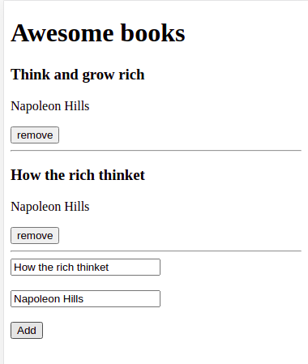

# electric vehicle conference website

This project was done in a Javascript module I'm taking from Microverse in how to use Javascript objects and DOM manipulation.

## Built With 
 - HTML
 - Javascript

## Getting started
to run the project locally, clone the project using the command 

`https://github.com/banlon-jones/awesome-books.git`
navigate in to the project directory, from GitHub,
to test or run the application double click on the `index.html` file to open in your browser

### Live Demo
click on the link below to view the portfolio website online

https://banlon-jones.github.io/awesome-books/
## Authors

### Author 1
 - Github: [banlon-jones](https://github.com/banlon-jones)
 - LinkedIn: [banlon jones](https://www.linkedin.com/in/banlon-jones-b0205812a)
 - Twitter: [@banlonjones](https://twitter.com/banlonjones)

## Acknowledgments

Thanks to the Microverse team with the structure of the project
